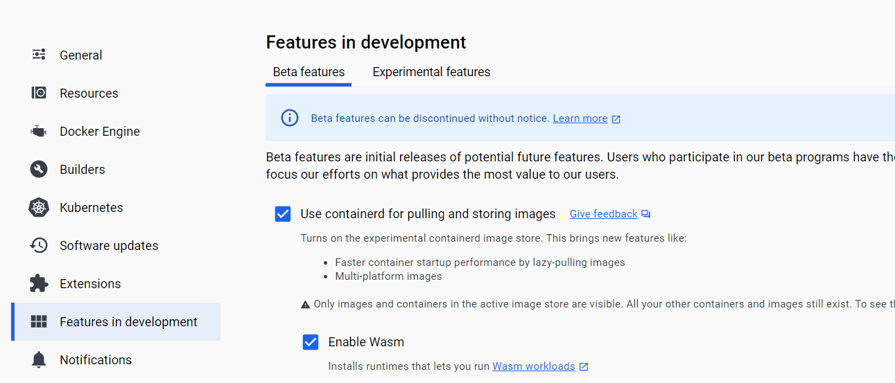

# Getting started

This sample is built from the Fermyon's TS HTTP Trigger.

This demo is using the **io.containerd.spin.v2** shim.

## Dependencies

- [Docker for Desktop](https://docs.docker.com/desktop/install/windows-install/)
- [Spin](https://developer.fermyon.com/spin/v2/install) 

You must enable an experimental feature in Docker for Desktop.  Ensure that these 2 checkboxes are checked:



## Build

Install dependencies, build & confirm listener is working:

```
npm install
spin build
```

You will now see a .wasm file in targets 📁:


To confirm the wasm application is working:

```
spin up
```

You should now see the HTTP serverless application being served up from port 3000:


Create image:

```
docker buildx build --platform wasi/wasm --provenance=false -t docker.io/garrardkitchen/helloworld:spin-0.5 .
```

## Run

Run container:

```
docker run -i --runtime=io.containerd.spin.v2 --platform=wasi/wasm -p 3000:80 docker.io/garrardkitchen/helloworld:spin-0.5 /
```

Shows container is running:


Shows listener's response:


Shows container log:


